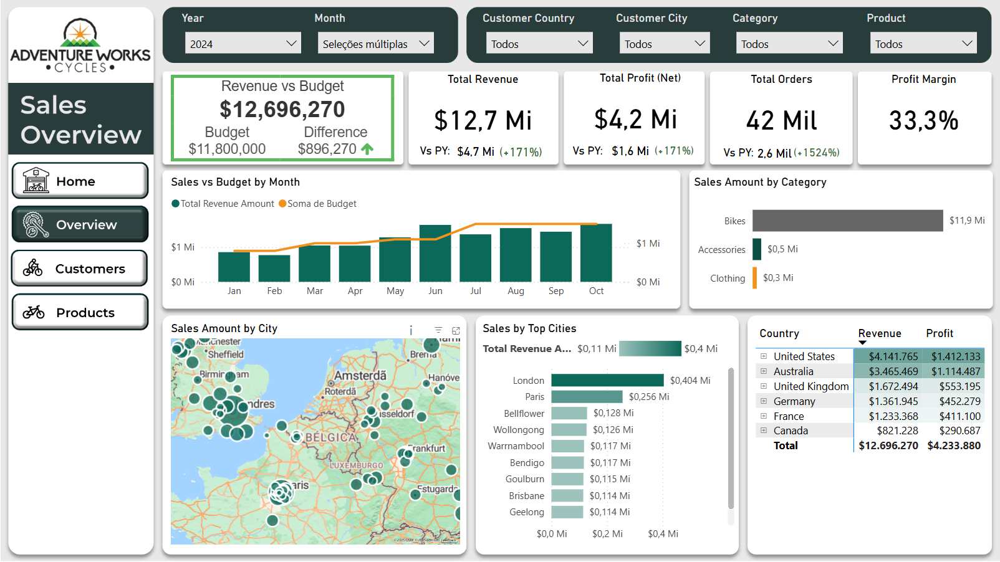

# 📊 Internet Sales and Performance Report – AdventureWorks (SQL + Power BI)

## 🗃️ Database  
[AdventureWorks sample databases – SQL Server | Microsoft Learn](https://learn.microsoft.com/en-us/sql/samples/adventureworks-install-configure?view=sql-server-ver16&tabs=ssms)

This project uses the **AdventureWorksDW2022** database (updated version).  
The database is stored locally and version-controlled via GitHub using **VS Code**, as part of my professional **BI Portfolio**.

/AdventureWorks_Portfolio/

---

## 📎 Published Power BI Report

[🌐 View the published Power BI Report on Power BI Service](https://app.powerbi.com/view?r=eyJrIjoiYzRhYzY3NzQtZjgxMy00Zjc4LThiM2YtMTAyMzdiNGQyMDE1IiwidCI6IjZkZWQwYTI3LTM3YWQtNDdhZS1iYzVmLTIxY2FhN2Q4NDdlMiJ9)

---

## 🧩 Business Request

### Email from Steven – Sales Manager

> “Hi all,  
> I hope you are doing well. We need to improve our internet sales reports and want to move from static reports to visual dashboards.  
> Essentially, we want to focus on **how much we have sold**, **of what products**, **to which clients**, and **how it has been over time**.  
> Since each salesperson works on **different products and customers**, it would be beneficial to be able to filter them as well.  
> We measure our numbers against **budget**, so I added that in a spreadsheet to compare our values against performance.  
> The **budget is for 2025**, and we usually look **2 years back** when we analyze sales.  
> Let me know if you need anything else!  
> // Steven”

---

## 📌 Business Demand Overview & User Stories

### 👤 Business User Stories

| No | Role                 | Request                                     | User Value                                      | Acceptance Criteria                             |
|----|----------------------|-------------------------------------------|-----------------------------------------------|------------------------------------------------|
| 1  | Sales Manager        | Dashboard overview of internet sales      | Understand top-performing customers/products | Power BI dashboard updating daily             |
| 2  | Sales Representative | Internet sales per customer               | Identify upselling opportunities              | Filterable customer insights in Power BI      |
| 3  | Sales Representative | Internet sales per product                | Track best-selling products                  | Product-level filtering in dashboard         |
| 4  | Sales Manager        | Compare sales over time vs. budget        | Monitor performance and variances            | KPIs + budget comparison in Power BI        |

---

### 👨‍💻 Data Analyst Tasks

| No | Task                                    | Objective                                    | Acceptance Criteria                            |
|----|----------------------------------------|--------------------------------------------|-----------------------------------------------|
| 1  | Track internet sales                   | Monitor online sales performance           | Sales totals + filters by category and time  |
| 2  | Measure product sales                  | Identify best/worst performers             | Sales quantity visual by product             |
| 3  | Analyze customer-product purchases     | Understand purchasing behavior            | Customer-product matrix                     |
| 4  | Visualize sales over time              | Detect trends + seasonality               | Line/area charts of time-based sales        |
| 5  | Filter by salesperson                  | Compare sales rep performance             | Slicers/filters for sales team             |
| 6  | Filter by product                      | Focus on specific product lines           | Product/category dropdowns                 |
| 7  | Filter by customer                     | Drill into individual clients             | Customer slicers + filters                 |
| 8  | Compare sales vs. 2025 budget          | Assess performance vs. targets           | Budget vs. actual visuals                  |
| 9  | Analyze 2023–2024 sales history       | Track recent trends                       | 24 months of data visualized               |

---

## ⚙️ Technical Process (SQL, Power Query, DAX)

### ✅ SQL ETL Process

- Extracted relevant columns using `SELECT`
- Integrated related dimensions with `LEFT JOIN`
- Cleaned + transformed data (`REPLACE`, `CONCAT`, `CONVERT`)
- Filtered for relevant periods (`WHERE` → 2023–2024)
- Created **SQL views** instead of CSV exports, enabling scalable, automated integration + **query folding** in Power BI
- Documented SQL scripts in the `SQL Queries` folder

### ✅ Power Query (Power BI)

- Imported SQL views from SQL Server
- Applied data type transformations
- Built a custom **calendar table** for date intelligence
- Merged datasets using Power Query transformations
- Removed duplicates, cleaned nulls, standardized column names

### ✅ DAX Measures

- Developed DAX measures in a dedicated **Measures Table**:
    - Total Revenue, Total Profit, Total Orders
    - Average Order Value, Profit Margin, Sales vs. Budget %
    - YoY (Year-over-Year) KPIs (Revenue, Profit, Orders)
    - YTD (Year-to-Date) calculations
- Used `CALCULATE`, `FILTER`, `ALL`, `DIVIDE`, `IF`, `SWITCH` for advanced logic

---

## 🧱 Data Model Overview

| Table                 | Description                                               |
|-----------------------|---------------------------------------------------------|
| DimCalendar_Calculated | Custom date table with month, quarter, year fields      |
| DimCustomer          | Customer details (joined with geography)                 |
| DimProducts         | Product details with category, line, model               |
| FactInternetSales   | Sales fact table with quantity, revenue, dates           |
| FactBudget         | Budget fact table for variance analysis                   |
| Measures_Table      | Central table for DAX measures (no physical data)         |

---

## 📊 Dashboard Overview (Power BI)

- Interactive navigation (Overview, Customers, Products pages)
- Filters: Year, Month, Country, City, Category, Product, Customer
- KPIs: Revenue, Profit, Orders, Profit Margin, Avg. Order Value
- Top products + top customers
- Sales vs. Budget analysis
- Sales by geography (map visuals)
- Trend visuals: Monthly, Category, City breakdowns

---

## 🚀 Final Deliverables

✅ SQL ETL + Views  
✅ Power Query Transformations  
✅ Calendar Table for Date Intelligence  
✅ DAX Measures + KPIs  
✅ Data Model Relationships  
✅ Power BI Dashboard with Storytelling  
✅ Report Published on Power BI Service

---

## 🌟 Link to Published Report

[👉 Click here to view the AdventureWorks Power BI Report](https://app.powerbi.com/view?r=eyJrIjoiYzRhYzY3NzQtZjgxMy00Zjc4LThiM2YtMTAyMzdiNGQyMDE1IiwidCI6IjZkZWQwYTI3LTM3YWQtNDdhZS1iYzVmLTIxY2FhN2Q4NDdlMiJ9)

---

Thank you for checking out this project!  
Feel free to reach out if you have questions or feedback.

---

## 📬 Connect with Me

  
✉️ [thiagojesus_87@hotmail.com](mailto:thiagojesus_87@hotmail.com)

